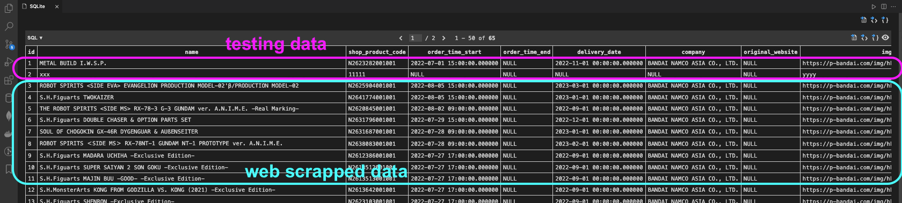

# webscrape-toy-figure-website

# Sample data



# Run scrapping and save into database

## Steps:

Generate database+table structure by code

https://alembic.sqlalchemy.org/en/latest/tutorial.html#creating-an-environment

0. Set up
   ```shell
   # see current path
   $ pwd
   xxx/xxx/learn-python-playground/webscrape-toy-figure-website

   # create and activate virtual environment
   $ virtualenv venv
   $ . venv/bin/activate

   # install poetry
   $ pip install poetry
 
   # poetry installs dependencies. Please run this cmd on the path containing `pyproject.toml` file
   $ poetry install
   ```

1. (Can skip if versions .py exists) Create a Migration Script
   ```shell
   $ alembic revision --autogenerate -m "Added initial table"
   INFO  [alembic.runtime.migration] Context impl SQLiteImpl.
   INFO  [alembic.runtime.migration] Will assume non-transactional DDL.
   INFO  [alembic.autogenerate.compare] Detected added table 'products'
   INFO  [alembic.autogenerate.compare] Detected added index 'ix_products_id' on '['id']'
      Generating /xxx/learn-python-playground/webscrape-toy-figure-website/alembic/versions/abe926e73e7c_added_initial_table.py ...  done
   ```

2. Prestart the application
   1. (Can run below `poetry run ./prestart.sh` instead) Running our First Migration 
      
      = create tables by the generated `/alembic/versions/abe926e73e7c_added_initial_table.py`
      
      ```shell
      $ alembic upgrade head
      INFO  [alembic.runtime.migration] Context impl SQLiteImpl.
      INFO  [alembic.runtime.migration] Will assume non-transactional DDL.
      INFO  [alembic.runtime.migration] Running upgrade  -> 9b32b90db2fb, Added initial tables
      ```
   2. OR Run
      ```shell
      $ poetry run ./prestart.sh
      INFO:__main__:Initializing service
      INFO:__main__:Starting call to '__main__.init', this is the 1st time calling it.
      INFO:__main__:Service finished initializing
      INFO  [alembic.runtime.migration] Context impl SQLiteImpl.
      INFO  [alembic.runtime.migration] Will assume non-transactional DDL.
      INFO  [alembic.runtime.migration] Running upgrade  -> abe926e73e7c, Added initial table
      INFO:__main__:Creating initial data
      INFO:__main__:Initial data created
      ```

3. Start to scrape all-product table
   ```shell
   $ poetry run python app/main.py
   
   # Use without `poetry`
   $ python app/main.py
   
   ```

   Output:
   ```shell
   /xxx/xxx/learn-python-playground/webscrape-toy-figure-website/app
   /xxx/xxx/learn-python-playground/webscrape-toy-figure-website
   >>> config= {'shop': '05-001', 'domain': 'https://p-bandai.com', 'product_list_slug': '/hk/search?text=&sort=relevance&shop={}&page={}', 'product_detail_slug': '/hk/item/{shop_product_code}', 'scraped_product_list_file_folder': './product_list/', 'scraped_product_detail_file_folder': './product_detail/', 'product_list_url': 'https://p-bandai.com/hk/search?text=&sort=relevance&shop={}&page={}', 'product_detail_url': 'https://p-bandai.com/hk/item/{shop_product_code}'}
   >>> _whole_url: https://p-bandai.com/hk/search?text=&sort=relevance&shop=05-001&page=0
   >>> _whole_url: https://p-bandai.com/hk/search?text=&sort=relevance&shop=05-001&page=1
   ...
   >>> __init__(), kwargs.keys()= dict_keys(['existing_product_list'])
   >>> _whole_url: https://p-bandai.com/hk/item/N2634941001001
   >>> scrapeOnePageData(), kwargs= {'url': 'https://p-bandai.com/hk/item/N2634941001001', 'page': 0, 'name': 'S.H.Figuarts IMIT-ULTRAMAN (SHIN ULTRAMAN)', 'img_url': 'https://p-bandai.com/img/hk/p/t/N2634941001001_001.jpg'}
   >>> url= https://p-bandai.com/hk/item/N2634941001001; shop_product_code= N2634941001001
   <class 'bs4.element.Tag'>
   >>> product__schedule= {'配送月份': '2023. 4', '開始預購': '2022. 8.5 15:00', '截止預購': None, '公司': 'BANDAI NAMCO ASIA CO., LTD.'}
   ...
   ```

---
<!-- 
# Run scrapping and save as .csv only

```shell
# see current path
$ pwd
xxxx/learn-python-playground/webscrape-toy-figure-website

# create and activate virtual environment
$ virtualenv venv
$ . venv/bin/activate

# install dependency
$ pip install -r requirement.txt

# Start to scrape all-product table
$ python app/main.py 

>>> _whole_url: https://p-bandai.com/hk/search?text=&sort=relevance&shop=05-001&page=0
>>> Created folder: ./product_list//html/shop=05-001/dt=20220704/
>>> _whole_url: https://p-bandai.com/hk/search?text=&sort=relevance&shop=05-001&page=1
>>> _whole_url: https://p-bandai.com/hk/search?text=&sort=relevance&shop=05-001&page=2
>>> _whole_url: https://p-bandai.com/hk/search?text=&sort=relevance&shop=05-001&page=3
>>> _whole_url: https://p-bandai.com/hk/search?text=&sort=relevance&shop=05-001&page=4
>>> _whole_url: https://p-bandai.com/hk/search?text=&sort=relevance&shop=05-001&page=5
>>> _whole_url: https://p-bandai.com/hk/search?text=&sort=relevance&shop=05-001&page=6
>>> _whole_url: https://p-bandai.com/hk/search?text=&sort=relevance&shop=05-001&page=7
>>> _whole_url: https://p-bandai.com/hk/search?text=&sort=relevance&shop=05-001&page=8
>>> _whole_url: https://p-bandai.com/hk/search?text=&sort=relevance&shop=05-001&page=9
>>> _whole_url: https://p-bandai.com/hk/search?text=&sort=relevance&shop=05-001&page=10
>>> _whole_url: https://p-bandai.com/hk/search?text=&sort=relevance&shop=05-001&page=11
>>> _whole_url: https://p-bandai.com/hk/search?text=&sort=relevance&shop=05-001&page=12
>>> _whole_url: https://p-bandai.com/hk/search?text=&sort=relevance&shop=05-001&page=13
>>> _whole_url: https://p-bandai.com/hk/search?text=&sort=relevance&shop=05-001&page=14
>>> _whole_url: https://p-bandai.com/hk/search?text=&sort=relevance&shop=05-001&page=15
>>> _whole_url: https://p-bandai.com/hk/search?text=&sort=relevance&shop=05-001&page=16
>>> _whole_url: https://p-bandai.com/hk/search?text=&sort=relevance&shop=05-001&page=17
>>> _whole_url: https://p-bandai.com/hk/search?text=&sort=relevance&shop=05-001&page=18
>>> _whole_url: https://p-bandai.com/hk/search?text=&sort=relevance&shop=05-001&page=19
>>> _whole_url: https://p-bandai.com/hk/search?text=&sort=relevance&shop=05-001&page=20
>>> _whole_url: https://p-bandai.com/hk/search?text=&sort=relevance&shop=05-001&page=21
>>> _whole_url: https://p-bandai.com/hk/search?text=&sort=relevance&shop=05-001&page=22
>>> _whole_url: https://p-bandai.com/hk/search?text=&sort=relevance&shop=05-001&page=23
>>> _whole_url: https://p-bandai.com/hk/search?text=&sort=relevance&shop=05-001&page=24
>>> _whole_url: https://p-bandai.com/hk/search?text=&sort=relevance&shop=05-001&page=25
>>> _whole_url: https://p-bandai.com/hk/search?text=&sort=relevance&shop=05-001&page=26
>>> Created folder: ./product_list//csv/shop=05-001/dt=20220704/
(817, 4)
   page                                               name           shop_product_code                                            img_url  
0     0                               METAL BUILD I.W.S.P.     /hk/item/N2623282001001  https://p-bandai.com/img/hk/p/t/N2623282001001...  
1     0  S.H.Figuarts KAMEN RIDER SABELA KONCHUU DAIHYAKKA     /hk/item/N2611071001001  https://p-bandai.com/img/hk/p/t/N2611071001001...
2     0          S.H.Figuarts KAMEN RIDER GENM MUSOU GAMER     /hk/item/N2631818001001  https://p-bandai.com/img/hk/p/t/N2631818001001... 
...                                                      
14    25           Super Robot 超合金 撃龍神 (Free Shipping)     /hk/item/N2171116001002  https://p-bandai.com/img/hk/p/t/N2171116001002...  
15    25                    FiguartsZERO 白星公主 [7月 發送]     /hk/item/N2171128001001  https://p-bandai.com/img/hk/p/t/N2171128001001...  
16    25    FiguartsZERO 白星公主 [7月 發送] (Free Shipping)     /hk/item/N2171128001002  https://p-bandai.com/img/hk/p/t/N2171128001002...
  
```


list all files:

```shell
# see current path
$ pwd
xxxx/learn-python-playground/webscrape-toy-figure-website

$ ls -l
-rw-r--r--  1 user  staff    3963  4 Jul 22:51 README.md
drwxr-xr-x  6 user  staff     192  4 Jul 23:00 app
drwxr-xr-x  4 user  staff     128  4 Jul 23:05 product_list
-rw-r--r--  1 user  staff     418  4 Jul 00:51 requirements.txt
drwxr-xr-x  7 user  staff     224  4 Jul 01:26 venv
``` -->